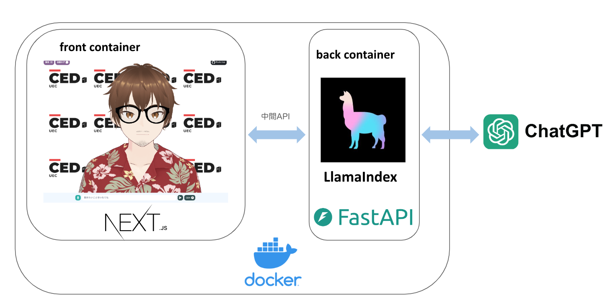

# 開発詳細ドキュメント

## 目次
- [システム構成について](#system-configuration)
- [使用技術について](#technology-used)
- [Git運用について](#git-flow)
- [コーディングルール](#coding-rule)
- [開発](#development)
- [デプロイについて](#deploy)

<h2 id="system-configuration">システム構成について</h2>



ChatVRM(https://github.com/pixiv/ChatVRM)に、電通大QAを回答できるようにRAGのバックエンドを追加した構成

<h2 id="technology-used">使用技術について</h2>

- フロント
  - TypeScript
  - React
  - Next.js (pages router)
- スタイル
  - tailwind
- バック
  - Python
  - fastapi
  - llama-index

<h2 id="git-flow">Git運用について</h2>

### ブランチについて

| ブランチ名     | 役割                           | 派生元   | マージ先            |
| -------------- | ------------------------------ | -------- | ------------------- |
| main        | 公開するものを置くブランチ     | main   | main              |
| dev        | 開発中のものを置くブランチ     | main   | main              |
| feature/*      | 新機能開発中に使うブランチ      | dev  | dev             |
| hotfix/*       | 公開中のもののバグ修正用ブランチ | main   | dev, main     |

### コミットメッセージの記法
なるべく下に従う
- `fix`: バグ修正
- `hotfix`: クリティカルなバグ修正
- `add`: 新規（ファイル）機能追加
- `update`: 機能修正（バグではない）
- `change`: 仕様変更
- `clean`: 整理（リファクタリング等）
- `disable`: 無効化（コメントアウト等）
- `remove`: 削除（ファイル）
- `upgrade`: バージョンアップ
- `revert`: 変更取り消し

<h2 id="coding-rule">コーディングルール</h2>

最低限のものを記載
- フロント
  - フォーマッター
    - ESLint
    - shift + alt + F(VScode のショートカット)
  - マジックナンバーは使わない
  - any型は使わない
  - 変数と関数 camelCase
- バック  
  - pep8準拠
  - 変数と関数 snake_case　

リーダブルコードを読もう！

<h2 id="development">開発</h2>

### Next.js フロントエンド開発ガイド

#### ページ作成
Next.jsでは、`pages` ディレクトリ内にファイルを作成することで、簡単にルーティングを設定できます。例えば、`pages/about.js` を作成すると、自動的に `/about` というルートが生成されます。

#### コンポーネント作成
再利用可能なUIコンポーネントは、`components` ディレクトリ内に作成します。例えば、ナビゲーションバーコンポーネントを作成する場合は、`components/Navbar.js` として作成し、必要なページや他のコンポーネントでインポートして使用します。

#### エンドポイントとAPI通信
新たなエンドポイントを作成する際には、中間APIを使用してバックエンドと通信します。Next.jsのAPIルート機能を活用して、`pages/api` ディレクトリ内にエンドポイントを作成し、フロントエンドからはこのエンドポイントを通じてバックエンドとやり取りを行います。

```javascript
// 例: pages/api/data.js
export default function handler(req, res) {
  // バックエンドAPIとの通信処理
  res.status(200).json({ message: "Hello from API" });
}
```

#### コードの可読性
コードは簡潔で読みやすく保ちます。関数やコンポーネントは必要に応じて適切に分割し、コメントを追加することで、他の開発者が理解しやすいようにします。長過ぎるコードは避け、可能な限りモジュール化を心がけます。

#### スタイリング
スタイルには主にTailwind CSSを使用します。Tailwind CSSは、ユーティリティファーストのCSSフレームワークで、迅速なスタイリングが可能です。ただし、Tailwindでは対応しきれない場合や特別なスタイルが必要な場合には、通常のCSSを使用しても構いません。

```javascript
// 例: components/Button.js
export default function Button({ children }) {
  return (
    <button className="bg-blue-500 text-white px-4 py-2 rounded">
      {children}
    </button>
  );
}
```

### バックエンド開発ガイド: Python FastAPI

#### コーディング規約とスタイル
- **PEP 8に従う**：Pythonの公式スタイルガイドであるPEP 8に従い、コードの一貫性と可読性を保つ。
- **関数と変数の命名**：関数名や変数名は意味のある名前を付け、コメントで補足説明を加える。

#### パフォーマンスと効率
- **非同期処理の活用**：FastAPIは非同期処理に対応しているため、`async` と `await` を適切に使用して、I/O操作（データベースクエリ、外部API呼び出しなど）の効率を高める。

```python
from fastapi import FastAPI

app = FastAPI()

@app.get("/")
async def read_root():
    return {"Hello": "World"}
```

#### エラーハンドリング
- **適切なHTTPステータスコード**：エラーが発生した場合は、適切なHTTPステータスコード（例：404, 500など）を返す。
- **詳細なエラーメッセージ**：ユーザーに分かりやすいエラーメッセージを提供し、ログに詳細なエラー情報を記録する。

```python
from fastapi import HTTPException

@app.get("/items/{item_id}")
async def read_item(item_id: int):
    if item_id not in items:
        raise HTTPException(status_code=404, detail="Item not found")
    return items[item_id]
```

### デプロイメント

- **適切なデプロイメント環境**：FastAPIアプリケーションを適切にデプロイし、UvicornやGunicornなどのASGIサーバーを使用して、高パフォーマンスを維持する。

```bash
uvicorn main:app --host 0.0.0.0 --port 8000 --reload
```

以上のポイントに注意してFastAPIを使用することで、安全で効率的なバックエンドシステムを構築することができます。
<h2 id="deploy">デプロイ</h2>

デプロイ前にconsole.logなどを全て消しておき、バグがないか十分にテストする

```bash
ssh you@brown01.ced.cei.uec.ac.jp

$ su -
password : 管理人の島崎さんから教えてもらったパスワード
$ cd ChatVRM
$ git pull
```

- brown01にsshを行う
- root権限に移行
- ChatVRMのディレクトリに移動
- ローカルで開発したものを事前にGitHubに挙げておき、pullを行う
  - ここでブランチをdevやfeatureにすることでテストも可能
  - ただし、本番環境での確認になるため基本はmainで行う
- https://brown01.ced.cei.uec.ac.jp/ced-iot/　にアクセス
